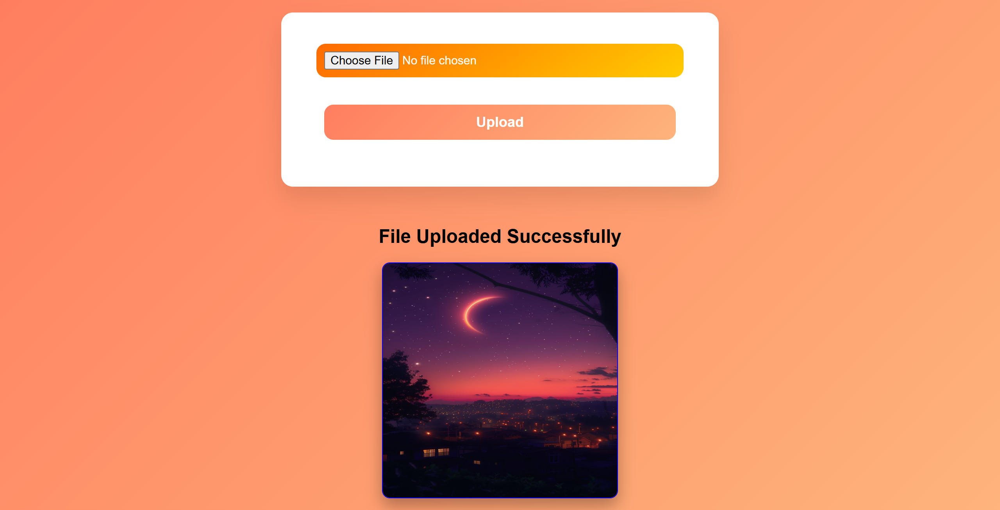

# 📸 Cloud-Based Image Uploader

A clean and modern **cloud-based image uploader** built using the MERN-style backend stack — **Node.js**, **Express**, **Multer**, **Cloudinary**, and **MongoDB**.
This app lets users upload and store images seamlessly on Cloudinary with a sleek, minimal UI.

🌐 **Live Demo:** [Image Uploader on Render](https://image-uploader-project-1.onrender.com)

---

## ✨ Features

* 🧩 **Cloud Uploads:** Upload images directly to Cloudinary
* 🗃️ **MongoDB Storage:** Save file URLs & metadata in MongoDB
* 📁 **Multer Integration:** Secure file parsing & validation
* 💅 **EJS Frontend:** Beautiful server-side rendered UI
* ⚡ **Fully Responsive Design:** Works smoothly on all screen sizes
* 🔐 **Environment Variables:** Secure API keys using `.env`

---

## 🧠 Tech Stack

| Technology             | Purpose                              |
| ---------------------- | ------------------------------------ |
| **Node.js**            | JavaScript runtime for backend       |
| **Express.js**         | Framework for building server routes |
| **Multer**             | Middleware for handling file uploads |
| **Cloudinary**         | Cloud-based image hosting            |
| **MongoDB + Mongoose** | Database & ORM                       |
| **EJS**                | Templating engine for views          |
| **CSS3**               | Styling & layout                     |

---

## ⚙️ Setup Instructions

1️⃣ **Clone the repository**

```bash
git clone https://github.com/SonaliDutta-Dev/Image-Uploader-Project.git
cd Image-Uploader-Project/image-uploader
```

2️⃣ **Install dependencies**

```bash
npm install
```

3️⃣ **Create a `.env` file**

```bash
MONGO_URI=your_mongodb_connection_string
CLOUD_NAME=your_cloudinary_name
API_KEY=your_cloudinary_api_key
API_SECRET=your_cloudinary_secret
PORT=3000
```

4️⃣ **Run the server**

```bash
nodemon server.js
```

Then open 👉 **[http://localhost:3000](http://localhost:3000)** in your browser.

---

## 📷 Preview



---

## 🚀 Deployment

This project is deployed on **Render** for free hosting.
You can deploy your own version easily using:

* Backend: [Render.com](https://render.com)
* Database: [MongoDB Atlas](https://www.mongodb.com/atlas)
* Cloud Storage: [Cloudinary](https://cloudinary.com/)

---

## 🧑‍💻 Author

**Sonali Dutta**
📚 BCA Student | 💻 MERN Stack Learner
🔗 [GitHub](https://github.com/SonaliDutta-Dev)

---


